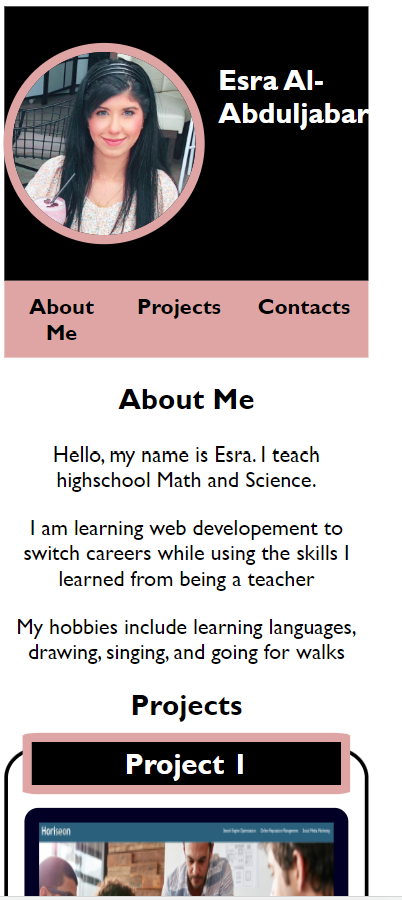
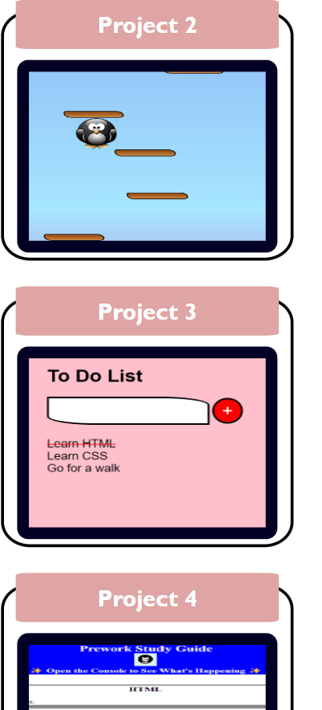

# Web Developement Personal Portfolio

## Description

In this project, a portfolio has been created to showcase my web developement work to potential hiring managers in a way that ensures their needs and requirements are being met.

To accomplish this, my full name has been included, a recent photo, as well as navigation section that links to different sections of the page such as "about me", "projects", and "Contacts". To ensure my most outstanding work is highlighted, the first project image has been increased in size in comparison with the other projects.

This portfolio is responsive and adjusts to different screen sizes to ensure that a good and smooth user experience is delivered.

## Technologies Used
- HTML
- CSS

## Deployed Application

https://esrawameed.github.io/Esra-Personal-Portfolio/

# On Surface Pro 7

# On Iphone XR

